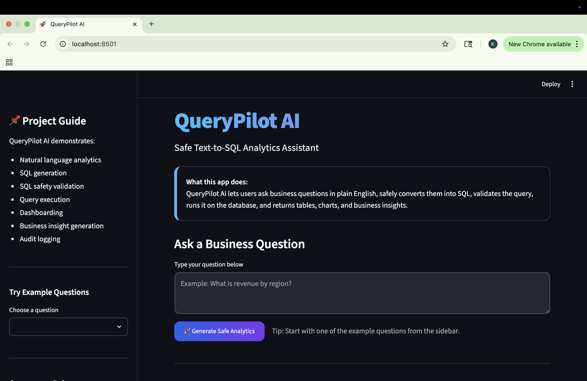
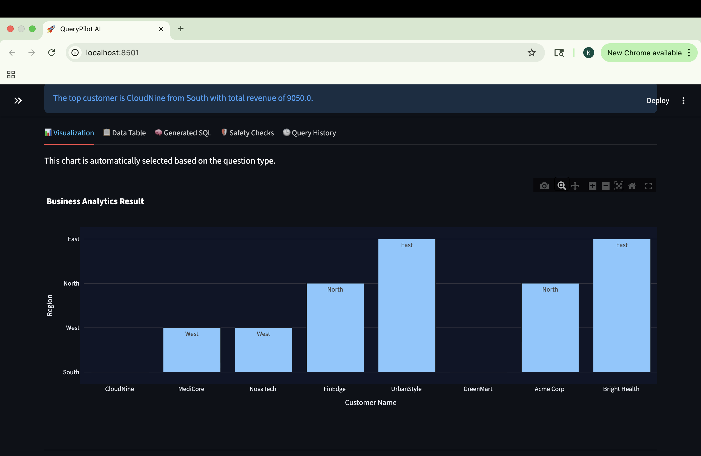
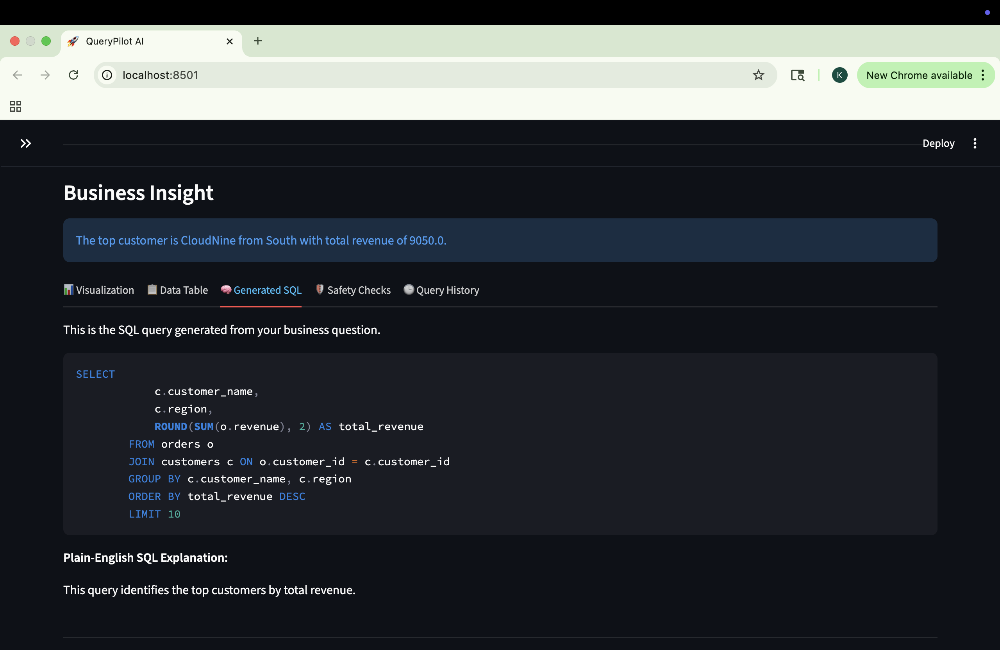
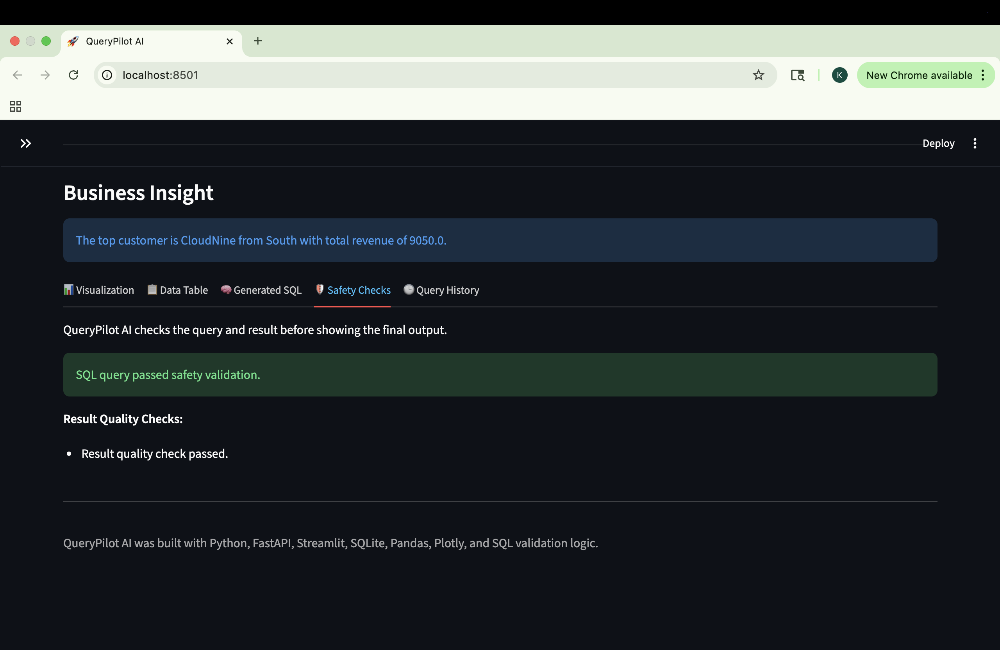
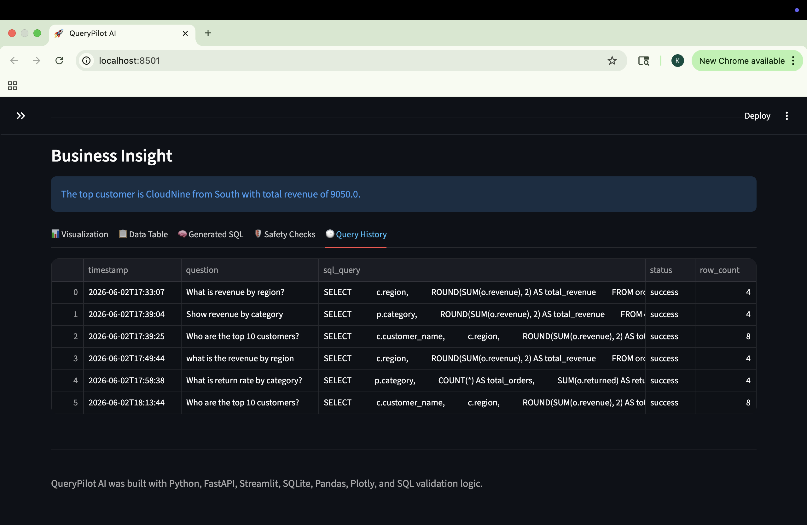
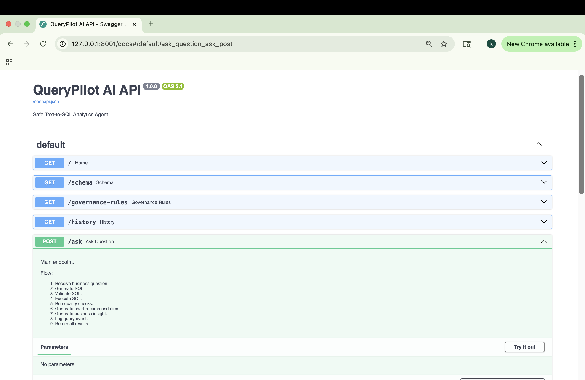

# QueryPilot AI — Safe Text-to-SQL Analytics Assistant

QueryPilot AI is a safe analytics assistant that allows business users to ask questions in plain English, converts those questions into SQL, validates the SQL for safety, runs the query on a SQLite database, and returns results as tables, charts, and business insights.

## Problem Statement

Business users often need quick insights from company databases but may not know how to write SQL. At the same time, allowing AI-generated SQL to run directly on databases can be risky because queries may be incorrect, unsafe, or difficult to audit.

QueryPilot AI solves this by creating a governed Text-to-SQL workflow that validates SQL before execution, blocks unsafe queries, generates visualizations, summarizes business insights, and logs query history for transparency.

## Features

- Natural language business question input
- Rule-based Text-to-SQL query generation
- SQL safety validation
- Read-only SQL execution
- Dangerous command blocking
- SQLite business database
- Query execution using Pandas
- Automated chart recommendation
- Plotly visualizations
- Business insight generation
- Result quality checks
- Query history and audit logging
- FastAPI backend
- Streamlit frontend

## Tech Stack

- Python
- FastAPI
- Streamlit
- SQLite
- Pandas
- NumPy
- Plotly
- sqlparse
- Requests
- Git & GitHub

## How It Works

```text
User Business Question
        ↓
Intent Detection
        ↓
SQL Query Generation
        ↓
SQL Safety Validation
        ↓
SQLite Query Execution
        ↓
Result Quality Checks
        ↓
Chart Recommendation
        ↓
Business Insight Generation
        ↓
Audit Logging
        ↓
Streamlit Dashboard Output
```

## Example Questions

You can ask:

```text
What is revenue by region?
Show revenue by category.
Show monthly sales trend.
Who are the top 10 customers?
What is return rate by category?
What is average order value by region?
Show discount analysis by region.
```

## Project Structure

```text
querypilot-ai/
├── backend/
│   ├── __init__.py
│   ├── main.py
│   ├── database.py
│   ├── query_generator.py
│   ├── sql_validator.py
│   ├── insight_generator.py
│   ├── chart_recommender.py
│   └── audit_logger.py
│
├── frontend/
│   └── streamlit_app.py
│
├── data/
├── screenshots/
├── README.md
├── requirements.txt
├── .gitignore
└── demo_notes.md
```

## Screenshots

### Home Page



### Visualization Result



### Generated SQL



### Safety Checks



### Query History



### FastAPI Docs



## Setup Instructions

Clone the repository:

```bash
git clone https://github.com/praneethamanu2/querypilot-ai.git
cd querypilot-ai
```

Create and activate a virtual environment:

```bash
python3 -m venv venv
source venv/bin/activate
```

Install dependencies:

```bash
pip install -r requirements.txt
```

## Run the Backend

Start the FastAPI backend:

```bash
uvicorn backend.main:app --reload --port 8001
```

Open FastAPI docs:

```text
http://127.0.0.1:8001/docs
```

## Run the Frontend

Open a second terminal and run:

```bash
streamlit run frontend/streamlit_app.py
```

Open the Streamlit app:

```text
http://localhost:8501
```

## Governance and Safety Layer

QueryPilot AI includes a SQL safety layer that:

- Allows only `SELECT` queries
- Blocks unsafe commands such as `DROP`, `DELETE`, `UPDATE`, `INSERT`, and `ALTER`
- Validates queries before execution
- Uses approved database tables only
- Logs query history for auditability
- Runs result quality checks before displaying insights

## Resume Bullet

Built QueryPilot AI, a governed Text-to-SQL analytics assistant using Python, FastAPI, Streamlit, SQLite, Pandas, Plotly, and SQL validation logic to convert natural language business questions into validated SQL queries, generate visualizations, produce business insights, and maintain audit logs.

## Future Improvements

- Add LLM-based SQL generation
- Add schema-aware prompt engineering
- Add semantic matching using embeddings
- Add user authentication
- Add PostgreSQL support
- Add Docker deployment
- Add automated unit tests
- Deploy the app online